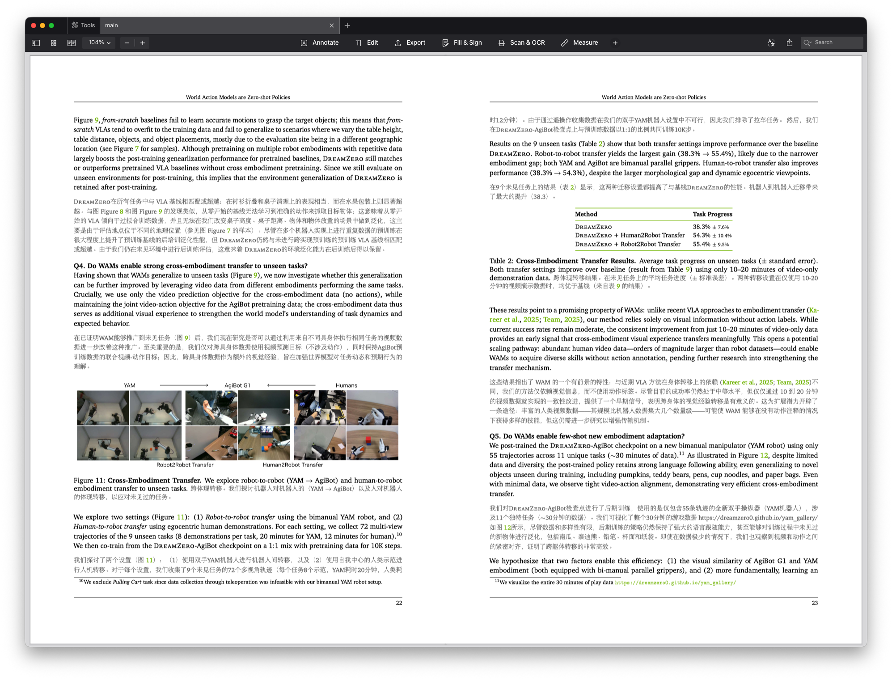

# arXiv 论文工具集

[English](README.md) | [中文](README-zh.md)

从 arXiv 下载论文，翻译为双语 PDF 或生成结构化摘要。



## 子命令

| 命令 | 说明 | 文档 |
|------|------|------|
| `translate` | 翻译为双语 PDF，保留数学公式与 LaTeX 排版 | [详细文档](papercli/translate/README-zh.md) |
| `summarize` | 调用 Codex 模型生成结构化摘要 | [详细文档](papercli/summarize/README-zh.md) |

## 安装

**Python 依赖**

```bash
pip install -r requirements.txt
```

**LaTeX 编译器**（`translate` 命令需要）

推荐使用 TinyTeX：

```bash
curl -sL "https://yihui.org/tinytex/install-bin-unix.sh" | sh
tlmgr install cjk ctex xecjk fontspec
```

**环境变量**

```bash
cp .env.example .env
# 编辑 .env，填入 API Key
```

## 快速开始

```bash
# 翻译论文
python run.py translate --input 2307.16789

# 生成摘要
python run.py summarize --input 2307.16789
```

## 兼容性说明

本项目在 macOS 上测试，Linux 理论上兼容，Windows 用户可能需要调整安装步骤。由于 arXiv 论文格式多样，无法保证所有论文都能成功翻译和编译。

## 许可证

Apache License 2.0
